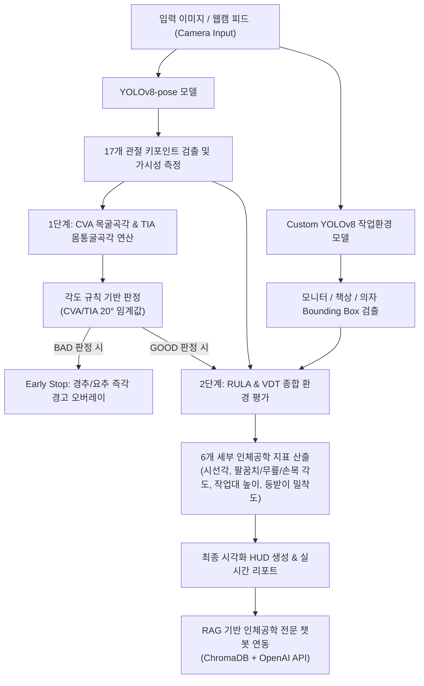

# 🪑🧘 자세히봐 (JASEE) — AI 자세 및 작업 환경 통합 분석 시스템

<p align="center">
  
</p>

> **RULA + VDT 고시 제2020-17호 기반 AI 실시간 자세 & 작업환경 측정 및 RAG 피드백 서비스**

사무직 근로자의 고질적인 문제인 **근골격계 질환(VDT 증후군) 예방**을 목적으로 개발된 스마트 헬스케어 AI 솔루션입니다. 웹캠을 통해 사용자의 자세와 주변 작업환경(모니터, 책상, 의자)을 실시간으로 분석하고, 수집된 9개 인체공학적 지표를 기반으로 **작업환경과 자세의 통합 분석을 통한 작업환경 조정** 과 **AI 피드백 및 맞춤형 가이드**(운동과 스트레칭)를 제공합니다.

---

## 🌐 English Project Summary
**JASEE (자세히봐)** is an AI-powered real-time ergonomic posture and workstation assessment service designed to prevent musculoskeletal disorders (VDT syndrome) for office workers.
- **Key Features**: Real-time CVA (Craniovertebral Angle) & TIA (Trunk Flexion Angle) calculation via **YOLOv8-pose**, angle-threshold-based posture classification (validated against an Attention MLP candidate — see [Post-hoc Validation](#-사후-검증-post-hoc-validation)), custom workstation object detection (monitor, desk, chair) via a self-trained YOLOv8 model, and an **Ergonomic RAG Chatbot** (using ChromaDB & OpenAI GPT-4o) trained on national VDT standards and guidelines.

---

## 🛠️ Tech Stack (기술 스택)

<p align="center">
  
  
  
  
  
  <br>
  
  
  
</p>

---

## 🎬 프로젝트 시연 및 발표 자료 (Demo & Presentation)

<p align="center">이 프로젝트의 실제 구동 영상과 기획/아키텍처에 대한 발표 자료를 아래 링크를 통해 직접 확인하실 수 있습니다.</p>

<table align="center">
  <tr align="center">
    <td><b>🎥 서비스 시연 영상 (Streamlit)</b></td>
    <td><b>📊 프로젝트 발표 자료 (PPT)</b></td>
  </tr>
  <tr align="center">
    <td>
      <a href="document/세미2 공모전 시연영상.mp4">
        
      </a>
      <br>
      <a href="document/세미2 공모전 시연영상.mp4">[시연 영상 재생 및 다운로드]</a>
    </td>
    <td>
      <a href="document/JASSE(자세히봐)_발표자료.pptx">
        
      </a>
      <br>
      <a href="document/JASSE(자세히봐)_발표자료.pptx">[발표 자료 다운로드]</a>
    </td>
  </tr>
</table>

---

## 💡 프로젝트 개요 (Project Overview)

현대 직장인과 학생들의 고질병인 근골격계 질환(거북목증후군, 척추측만증 등)은 단순히 **"신체 자세"**뿐만 아니라 모니터 높이, 책상 높이, 의자 밀착도 등 **"작업 환경(Ergonomic Environment)"**과의 관계에서 비롯됩니다.

**자세히봐 (JASEE)**은 이러한 한계를 극복하기 위해 다음 두 가지 핵심 AI 기술을 융합합니다:
1. **Yolo pose**: 사용자의 주요 신체 관절 랜드마크(33개 좌표) 추출 및 실시간 각도 연산
2. **Custom YOLOv8**: 사무실 환경 객체(모니터, 책상, 의자) 탐지 및 공간 좌표 획득

이 두 모델의 출력을 결합하여 **총 8가지 핵심 VDT/RULA 표준 지표**를 실시간으로 평가하고, 실물 크기 오버레이와 인터랙티브 시각화를 통해 직관적인 피드백을 제시합니다.


---

## ⚙️ 시스템 아키텍처 (System Architecture)



---

## ✨ 핵심 기능 


### 1. 실시간 자세 측정 & 분석 (Step 1)
* **YOLOv8-pose**: 사용자의 17개 관절 포인트를 추적하여 거북목 예방을 위한 CVA(목굴곡각) 및 허리 디스크 방지를 위한 TIA(몸통굴곡각)를 연산합니다.
* **각도 규칙 기반 판정**: CVA·TIA가 모두 정상 범위(0~20°)일 때만 GOOD으로 판정합니다. 초기에는 Attention MLP 딥러닝 모델로 96.3%의 Recall을 보고했으나, 사후 검증 결과 학습 라벨과 판정 규칙이 통계적으로 구분되지 않는 구조였음을 확인하고 규칙 기반으로 전환했습니다. 자세한 내용은 [사후 검증](#-사후-검증-post-hoc-validation) 참고.

### 2. 작업환경 자동 감지 & 인체공학 분석 (Step 2)
* 자세 상태가 일정 시간 동안 'GOOD'으로 유지되면, 자동으로 **작업환경 측정 모드**로 전환됩니다.
* 의자 등받이, 의자 시트, 책상, 모니터 객체를 탐지하고 관절 좌표와 융합 연산하여 **시선각**, **작업대 높이**, **등받이 밀착도** 등 RULA + VDT 기준을 만족하는지 진단합니다.

### 3. 사용자 대시보드 및 리포트
* 일일 측정 이력 추이 그래프 및 바른자세 챌린지 점수 랭킹 보드를 제공합니다.
* 자세 상태에 따른 타겟 부위 스트레칭 요령 및 인체공학 교정 제품 추천 기능이 제공됩니다.

### 4. RAG(검색 증강 생성) 기반 인체공학 챗봇 💡
* **정보 신뢰성 극대화**: 고용노동부 VDT 고시 제2020-17호, KOSHA GUIDE 등의 전문 공인 문서를 파싱하여 데이터베이스로 사용하므로, LLM의 한계인 환각(Hallucination) 현상을 차단합니다.
* **Ko-sroberta 임베딩 & ChromaDB**: 사용자의 질문과 실시간 측정된 신체 각도 데이터를 벡터화하여 로컬 벡터 DB에서 관련 조항을 초고속으로 검색합니다.
* **오픈 API 백업**: 내부 RAG 데이터베이스 외에도 질병관리청 국가건강정보포털 API와의 유연한 연동을 통해 다양한 근골격계 질환 정보를 실시간으로 보완합니다.

---

## 📊 8가지 핵심 진단 지표 (Diagnostic Metrics)

본 프로젝트는 고용노동부 VDT 증후군 예방지침 및 RULA(Rapid Upper Limb Assessment) 평가 시스템을 기반으로 **8대 정밀 자세 및 환경 지표**를 정의하여 정밀 측정합니다.

| 번호 | 지표명 | 측정 방식 | 정상 기준 범위 | 교정 제안 가이드 |
|:---:|---|---|---|---|
| **01** | **CVA 목굴곡각** | 귀(Tragus)와 어깨(Acromion) 연결선의 연직각 | 0° ~ 20° | 모니터 상단을 눈높이로 조절, 거북목 의심 |
| **02** | **TIA 몸통굴곡각** | 어깨와 골반(Hip) 연결선의 연직각 | 0° ~ 10° | 골반을 의자 뒤쪽까지 완전히 밀착 |
| **03** | **팔꿈치 각도** | 어깨-팔꿈치-손목 관절 내각 | 90° ~ 120° | 팔꿈치와 책상이 수평이 되도록 의자 높이 조절 |
| **04** | **무릎 각도** | 골반-무릎-발목 관절 내각 | 85° ~ 100° | 무릎이 90° 전후가 되도록 조절, 발받침대 권장 |
| **05** | **손목 각도** | 팔꿈치-손목-손가락MCP 각도의 수평 편차 | ±15° 이내 | 키보드 앞 15cm 공간 확보 및 손목받침대 사용 |
| **06** | **모니터 시선각** | 눈과 모니터 중심점 연결선이 이루는 하방각 | 10° ~ 15° | 모니터 상단과 눈높이 일치, 화면 거리 40cm 이상 |
| **07** | **작업대 높이** | 팔꿈치 y좌표 대비 책상 상판 y좌표 편차 | ±10% 이내 | 책상 높이 조정 혹은 의자 높이를 통한 팔꿈치 정렬 |
| **08** | **의자 등받이** | 골반 x좌표와 의자 등받이 끝단의 상대 거리 | 골반폭 20% 이내 | 등받이에 요추가 밀착되도록 지지 쿠션 사용 권장 |

### 🛑 지능형 2단계 의사결정 파이프라인 (Early Stop)
- **1단계 (경추 & 요추 보호)**: 코어 지표인 **CVA**와 **TIA**가 각각 정상 범위(0~20°) 내에 있는지로 1차 판정합니다(`jasee_core.py`의 `predict_posture()`). 두 지표 중 하나라도 비정상(`BAD`) 범주에 속하면, **불필요한 연산을 방지하기 위해 파이프라인을 조기 종료(Early Stop)**하고 척추 중심선에 즉시 빨간색 경고 오버레이와 자세 교정 화살표를 표시합니다. 이 판정 로직은 원래 Attention MLP 딥러닝 모델(`final_attention_mlp.pt`)을 사용했으나, 사후 검증을 거쳐 규칙 기반으로 전환했습니다(아래 [사후 검증](#-사후-검증-post-hoc-validation) 섹션 참고). 딥러닝 모델 코드와 가중치는 검증된 후보로 저장소에 그대로 보존되어 있습니다.
- **2단계 (종합 환경 진단)**: 1단계 코어 자세가 양호할 경우에 한하여 2단계 정밀 분석을 활성화합니다. YOLO가 감지한 가구(책상, 의자, 모니터)와의 공간 관계 및 사지 각도 6종을 추가 연산하여 정밀 HUD 및 세부 교정 가이드를 실시간으로 매핑합니다.


---

## 🔍 사후 검증 (Post-hoc Validation)

발표 시점에는 관절 좌표 16개 피처(원시 좌표 10 + 분절 거리 4 + 각도 2)로 학습한 **Attention MLP**가 Recall 96.3%를 기록해 이를 채택했습니다. 발표 이후 직접 코드를 재검증한 결과, 이 성능 수치를 신뢰할 수 없다는 것을 확인했고, 판정 로직을 규칙 기반으로 되돌렸습니다. 재현 스크립트: [`validate_jasee.py`](validate_jasee.py)

### 검증 결과

| 검증 항목 | 결과 |
|---|---|
| 증강 이미지 누수 | test 240장 중 152장(63.3%)이 train에 좌우반전 쌍 보유 |
| 누수 차단 시 성능 변화 | AUC 0.832 → 0.783, Accuracy 0.838 → 0.774 |
| 학습 라벨-각도 규칙 일치율 | 99.7% — 학습 라벨은 사실상 규칙의 출력 |
| 규칙 vs 모델 (사람이 직접 검수한 라벨 238장 기준) | rule-only Accuracy **0.811** vs Attention MLP **0.578** |
| 경계 구간(15~25°)에서도 | rule-only 0.688 vs Attention MLP 0.544 — 딥러닝이 규칙을 넘어서지 못함 |
| 배포 코드 피처 계약 | `predict_posture()`가 학습 피처와 다른 값을 모델에 전달 — 배포된 모델 출력이 학습된 판별 경계와 무관했음 |

**결론** 학습 피처에는 CVA·TIA 각도 자체는 없었지만, 그 각도를 계산하는 데 필요한 좌표(귀·어깨·골반)가 원시 좌표 10개 안에 포함되어 있어, 모델이 입력만으로 라벨 생성 규칙을 재구성할 수 있는 구조였습니다. Recall 96.3%는 임상 판단 재현이 아니라 규칙 재현 능력으로 해석해야 합니다.

### 검증 후 실제로 반영한 코드 수정

| 파일 | 수정 내용 |
|---|---|
| `jasee_core.py` | `predict_posture()`에서 AttentionMLP 호출 제거, CVA·TIA 각도 규칙(`is_good`) 기반 판정으로 전환 |
| `config.py` (신규) | 하드코딩된 절대경로(`D:\`, `E:\`, `C:\Windows\Fonts\...`)를 OS별 상대경로·폰트 탐색 함수로 전환 |
| `requirements.txt` | 실제 사용 중이나 누락되어 있던 `scikit-learn`, `xgboost`, `optuna` 등 보완 |
| `Yolo_pose/03_model(attetion MLP)_improvement/` | `03_model_improvement/`로 폴더명 정리 |

`AttentionMLP` 클래스 정의와 학습된 가중치(`final_attention_mlp.pt`)는 삭제하지 않고 **검증 후 기각한 후보**로 저장소에 보존했습니다.

### 이 프로젝트에서 딥러닝이 필요했던 지점 / 필요 없었던 지점

같은 프로젝트 안에서도 판정 대상에 따라 결론이 달랐습니다.

| 구성 요소 | 방식 | 사후 검증 결과 |
|---|---|---|
| 관절 키포인트 검출 | YOLOv8-pose (사전학습) | 딥러닝 필수 — 규칙으로 대체 불가 |
| **자세 GOOD/BAD 판정** | ~~Attention MLP~~ → **각도 규칙** | **딥러닝 불필요** — 규칙이 더 정확 |
| 작업환경(모니터·책상·의자) 탐지 | Custom YOLOv8 (397장 직접 라벨링) | 딥러닝 필수, mAP50 **0.981** — 순환 구조 없는 독립적 학습 성과 |

---

## 📂 프로젝트 구조 (Project Structure)

### 🌿 디렉토리 트리 개요
```
JASEE/
├── Yolo_env/            # 작업환경(의자/책상/모니터) 탐지 모델 학습 코드
├── Yolo_pose/           # 실시간 자세 분류(Attention MLP) 모델 학습 코드
├── 자세히봐_RAG/         # RAG 시스템 구축을 위한 원천 문서 및 DB 자료
├── processed_data/      # preprocess_jasee.py 실행 후 생성되는 청크 JSON 폴더
├── vector_db/           # build_vectordb.py 실행 후 생성되는 ChromaDB 폴더
├── assets/              # UI 아이콘, 피드백 이미지 및 리소스
├── document/            # 프로젝트 발표 PPTX 및 시연 영상 MP4
└── *.py (실행 파일)       # Streamlit 웹앱 및 백엔드 실행 스크립트
```

### 📋 상세 폴더 및 파일 설명
| 분류 | 경로명 | 설명 |
| :--- | :--- | :--- |
| **핵심 실행 스크립트** | [app_web.py](app_web.py) | 모바일/데스크톱 뷰를 통합 제공하는 Streamlit 올인원 웹 서비스 실행 파일 |
| | [jasee_core.py](jasee_core.py) | 비전 연산(YOLOv8-pose + Attention MLP 자세 예측) 및 오버레이 드로잉 엔진 |
| | [chatbot.py](chatbot.py) | RAG 기반 인체공학 피드백 챗봇 백엔드 스크립트 |
| **RAG 파이프라인** | [preprocess_jasee.py](preprocess_jasee.py) | VDT 지침서(PDF/DOCX/JSON)를 문단 단위 청크(Chunk)로 분할/전처리하는 파이프라인 |
| | [build_vectordb.py](build_vectordb.py) | 한국어 임베딩 모델을 적용해 청크를 ChromaDB로 인덱싱하여 벡터 DB 구축 |
| | `자세히봐_RAG/` | RAG에 주입되는 원천 데이터 (VDT 고시 문서, 부위별 질환/통증 데이터 등) |
| | `processed_data/` | 전처리 단계를 거쳐 생성된 청크 데이터 JSON 파일들이 저장되는 위치 |
| | `vector_db/` | 임베딩 인덱스가 저장되는 ChromaDB 데이터베이스 폴더 |
| **AI 모델 개발** | `Yolo_pose/` | 17개 관절 좌표 기반 자세 이중 분류 모델(ML/DL) 비교 연구 및 Attention MLP 모델 가중치 |
| | `Yolo_env/` | 모니터/의자/책상 인식 커스텀 YOLOv8n 모델 이미지 증강 및 학습 코드 |
| **기타 리소스** | `document/` | 스트림릿 시연 동영상 및 발표용 프레젠테이션 PPTX 자료 |
| | `assets/` | 웹앱 상에 시각화할 동작 피드백 가이드 이미지 및 아이콘 |

---

## 🚀 시작 가이드 (Quick Start)

### 1. 리포지토리 클론 및 폴더 이동
```bash
git clone https://github.com/areum-mong/JaSEE.git
cd JaSEE
```

### 2. 가상환경 생성 및 활성화
```bash
conda create -n jasee python=3.10
conda activate jasee
```

### 3. 필수 라이브러리 설치
```bash
pip install -r requirements.txt
pip install torch torchvision torchaudio --index-url https://download.pytorch.org/whl/cu121
```

> 데이터·결과 저장 경로는 `config.py`가 관리합니다. 기본값은 저장소 내부 상대경로이며, 필요 시 환경변수(`JASEE_DATA_DIR`, `JASEE_RESULTS_DIR`)로 덮어쓸 수 있습니다. 한글 폰트도 `config.korean_font()`가 OS(Windows/macOS/Linux)를 자동 감지해 찾으므로 별도 설정이 필요 없습니다.

### 4. 환경 변수 설정 (`.env` 생성)
```env
OPENAI_API_KEY=your_openai_api_key_here
```

### 5. RAG 벡터 데이터베이스 구축
```bash
python preprocess_jasee.py
python build_vectordb.py
```

### 6. 서비스 실행
```bash
streamlit run app_web.py
```


---

## ⚠️ 면책 조항 (Disclaimer)
* 본 서비스는 의학적 진단 및 치료를 대체할 수 없습니다.
* 분석된 수치와 리포트는 바른 자세 및 올바른 작업 환경을 유지하기 위한 **가이드 및 참고용**으로만 활용하시기 바랍니다.
* 지속적인 통증이나 척추 질환이 의심되는 경우, 반드시 정형외과 전문의 등 의료 전문가와의 상담을 권장합니다.
