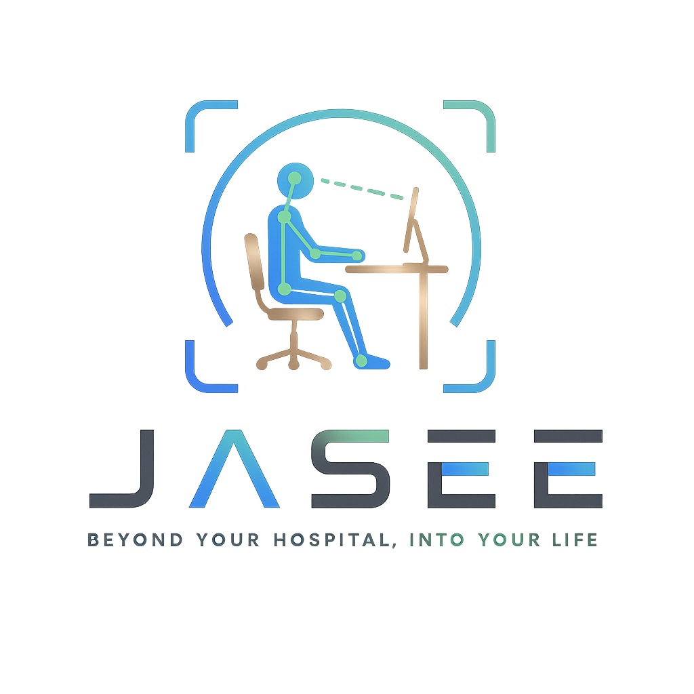
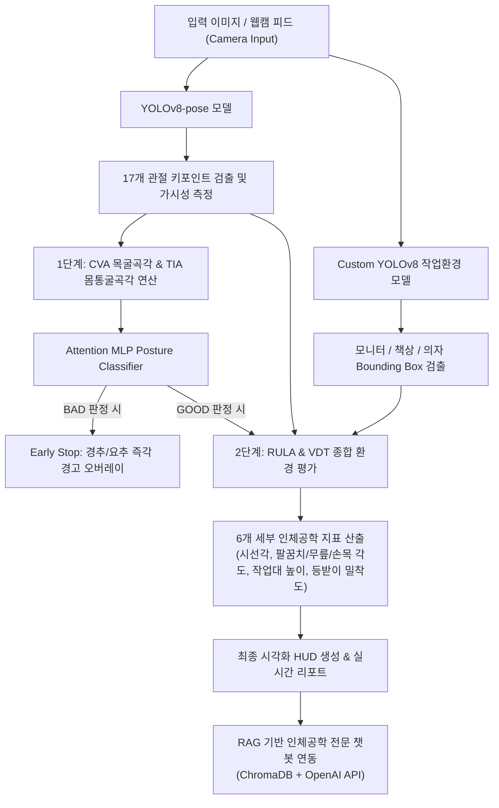

# 🪑 자세히봐 (JASEE)

<p align="center">
  
</p>

> **RULA + VDT 고시 제2020-17호 기반 AI 실시간 자세 & 작업환경 측정 및 RAG 피드백 서비스**

사무직 근로자의 고질적인 문제인 **근골격계 질환(VDT 증후군) 예방**을 목적으로 개발된 스마트 헬스케어 AI 솔루션입니다. 웹캠을 통해 사용자의 자세와 주변 작업환경(모니터, 책상, 의자)을 실시간으로 분석하고, 수집된 9개 인체공학적 지표를 기반으로 AI 피드백 및 맞춤형 스트레칭 가이드를 제공합니다.

---

## 🌐 English Project Summary
**JASEE (자세히봐)** is an AI-powered real-time ergonomic posture and workstation assessment service designed to prevent musculoskeletal disorders (VDT syndrome) for office workers.
- **Key Features**: Real-time CVA (Craniovertebral Angle) & TIA (Trunk Flexion Angle) calculation via **YOLOv8-pose**, posture classification via an **Attention MLP Classifier**, custom workstation object detection (monitor, desk, chair), and an **Ergonomic RAG Chatbot** (using ChromaDB & OpenAI GPT-4o) trained on national VDT standards and guidelines.

---

## 🛠️ Tech Stack (기술 스택)

<p align="left">
  
  
  
  
  
  <br>
  
  
  
</p>

---

## 🎬 프로젝트 시연 및 발표 자료 (Demo & Presentation)

이 프로젝트의 실제 구동 영상과 기획/아키텍처에 대한 발표 자료를 아래 링크를 통해 직접 확인하실 수 있습니다.

| 🎥 서비스 시연 영상 (Streamlit) | 📊 프로젝트 발표 자료 (PPT) |
| :---: | :---: |
| <a href="document/스트림릿시연영상.mp4"></a><br>[시연 영상 재생 및 다운로드] | <a href="document/JASSE(자세히봐)_발표자료.pptx"></a><br>[발표 자료 다운로드] |

---

## ⚙️ 시스템 아키텍처 (System Architecture)

사용자의 측면 실시간 영상 피드로부터 관절 좌표를 추출하는 **YOLOv8-pose** 단계와 주변 기기를 탐지하는 **Custom YOLOv8** 단계를 거쳐, 최종 **RAG 피드백**을 제공하는 시스템 흐름도입니다.



---

## ✨ 핵심 기능 (RAG 파이프라인 강조)

### 1. RAG(검색 증강 생성) 기반 인체공학 챗봇 💡
* **정보 신뢰성 극대화**: 고용노동부 VDT 고시 제2020-17호, KOSHA GUIDE 등의 전문 공인 문서를 파싱하여 데이터베이스로 사용하므로, LLM의 한계인 환각(Hallucination) 현상을 차단합니다.
* **Ko-sroberta 임베딩 & ChromaDB**: 사용자의 질문과 실시간 측정된 신체 각도 데이터를 벡터화하여 로컬 벡터 DB에서 관련 조항을 초고속으로 검색합니다.
* **오픈 API 백업**: 내부 RAG 데이터베이스 외에도 질병관리청 국가건강정보포털 API와의 유연한 연동을 통해 다양한 근골격계 질환 정보를 실시간으로 보완합니다.

### 2. 실시간 자세 측정 & 분석 (Step 1)
* **YOLOv8-pose**: 사용자의 17개 관절 포인트를 추적하여 거북목 예방을 위한 CVA(목굴곡각) 및 허리 디스크 방지를 위한 TIA(몸통굴곡각)를 연산합니다.
* **Attention MLP Classifier**: 단순 각도 임계값 판정을 넘어 딥러닝 Attention 메커니즘을 통해 종합적인 상반신 정렬 상태를 판정합니다.

### 3. 작업환경 자동 감지 & 인체공학 분석 (Step 2)
* 자세 상태가 일정 시간 동안 'GOOD'으로 유지되면, 자동으로 **작업환경 측정 모드**로 전환됩니다.
* 의자 등받이, 의자 시트, 책상, 모니터 객체를 탐지하고 관절 좌표와 융합 연산하여 **시선각**, **작업대 높이**, **등받이 밀착도** 등 RULA + VDT 기준을 만족하는지 진단합니다.

### 4. 사용자 대시보드 및 리포트
* 일일 측정 이력 추이 그래프 및 바른자세 챌린지 점수 랭킹 보드를 제공합니다.
* 자세 상태에 따른 타겟 부위 스트레칭 요령 및 인체공학 교정 제품 추천 기능이 제공됩니다.

---

## 📐 측정 및 판정 기준 (RULA + VDT 고시)

| 지표 | 정상 범위 (GOOD) | 산출 기준 및 기술적 배경 |
| :--- | :--- | :--- |
| **CVA (목굴곡각)** | 0° ~ 20° | 수직축 대비 귀(Ear)와 어깨(Shoulder) 라인이 이루는 각도 (RULA Neck Score 연계) |
| **TIA (몸통굴곡각)** | 0° ~ 20° | 수직축 대비 어깨 중점과 골반 중점이 이루는 각도 (RULA Trunk Score 연계) |
| **무릎 각도** | 85° ~ 100° | 골반(Hip) - 무릎(Knee) - 발목(Ankle) 사이의 내각 (VDT 고시 기준) |
| **팔꿈치 각도** | 90° ~ 120° | 어깨(Shoulder) - 팔꿈치(Elbow) - 손목(Wrist) 사이의 내각 (VDT 고시 기준) |
| **손목 각도** | ±15° 이내 | 중립 자세 기준 손목 꺾임 편차 (VDT 고시 기준) |
| **모니터 시선각** | 하방 10° ~ 15° | 눈(Eye) 중점과 모니터 중심점 사이의 하방 시선각 (VDT 고시 제6조) |
| **작업대 높이** | 팔꿈치 기준 ±10% 이내 | 팔꿈치 높이 대비 책상 상면의 높이 비율 편차 (VDT 고시 기준) |
| **의자 등받이** | 골반 너비의 20% 이내 | 골반 위치와 의자 등받이 끝부분 사이의 수평 거리 비율 (VDT 고시 기준) |

---

## 📂 프로젝트 구조

```
📁 JASEE/
├── 📁 Yolo_env/                     # 작업환경 인식 모델 학습 및 처리
├── 📁 Yolo_pose/                    # 자세 분류 머신러닝/딥러닝 모델 개발
├── 📁 자세히봐_RAG/                 # RAG 파이프라인 구축을 위한 원천 데이터
│   ├── 📁 Q&A/                      # 부위별/점수별 Q&A 매핑 데이터
│   ├── 📁 기능1~3_자료/             # VDT 고시 PDF 및 자세분석기준 DOCX 지침 문서
│   ├── 📁 기능4_부위별 통증 완화 방법 답변/  # 근골격계 통증 DB 및 질병청 API 테스트
│   └── 📁 기능5_개인화 맞춤 운동 추천(자세맵핑)/  # UCS/LCS 체형 별 맞춤 운동 추천 DB
├── 📁 processed_data/               # 전처리된 JSON 청크 데이터 저장 폴더
├── 📁 vector_db/                    # ChromaDB 벡터 데이터베이스 저장 폴더
├── 📁 assets/                       # UI 리소스, 스트레칭 애니메이션 및 아이콘
├── 📁 document/                     # 프로젝트 발표 PPTX 및 시연 영상 MP4
│
├── 📄 preprocess_jasee.py           # RAG 데이터 파이프라인 (문서 파싱 및 청크 변환)
├── 📄 build_vectordb.py             # ChromaDB 구축 및 임베딩 생성
├── 📄 chatbot.py                    # RAG 인체공학 챗봇 핵심 실행 파일 (CLI / API 연동)
├── 📄 jasee_core.py                 # 비전 인식 핵심 백엔드 엔진 (YOLO + MLP + 각도 연산)
│
├── 📄 app_mobile.py                 # 모바일 레이아웃 최적화 Streamlit 웹앱
├── 📄 app_desktop.py                # 데스크톱 레이아웃 최적화 Streamlit 웹앱
├── 📄 app_web.py                    # 모바일/데스크톱 기능 통합 올인원 Streamlit 웹앱
│
├── 📄 yolov8n-pose.pt               # YOLOv8 공식 Pose 검출 가중치 파일
├── 📄 requirements.txt              # 전체 프로젝트 의존성 라이브러리 목록
└── 📄 logo.png                      # 프로젝트 로고 이미지
```

---

## 🚀 시작 가이드 (Quick Start)

### 1. 리포지토리 클론 및 폴더 이동
```bash
git clone https://github.com/areum-mong/JaSEE.git
cd JaSEE
```

### 2. 가상환경 생성 및 활성화
```bash
conda create -n jasee python=3.10
conda activate jasee
```

### 3. 필수 라이브러리 설치
```bash
pip install -r requirements.txt
pip install torch torchvision torchaudio --index-url https://download.pytorch.org/whl/cu121
```

### 4. 환경 변수 설정 (`.env` 생성)
```env
OPENAI_API_KEY=your_openai_api_key_here
```

### 5. RAG 벡터 데이터베이스 구축
```bash
python preprocess_jasee.py
python build_vectordb.py
```

### 6. 서비스 실행
```bash
streamlit run app_web.py
```


## ⚠️ 면책 조항 (Disclaimer)
* 본 서비스는 의학적 진단 및 치료를 대체할 수 없습니다.
* 분석된 수치와 리포트는 바른 자세 및 올바른 작업 환경을 유지하기 위한 **가이드 및 참고용**으로만 활용하시기 바랍니다.
* 지속적인 통증이나 척추 질환이 의심되는 경우, 반드시 정형외과 전문의 등 의료 전문가와의 상담을 권장합니다.
